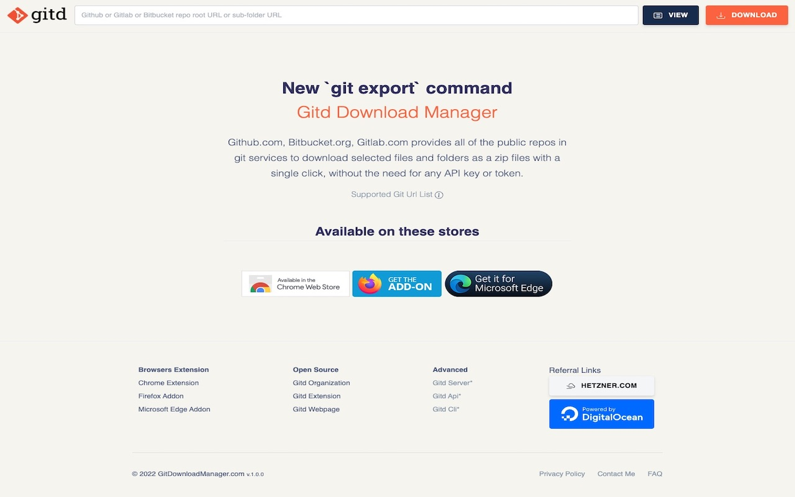

# Gitd Main Website
Website of [GitDownloadManager.com](https://gitdownloadmanager.com)



> Website source code with cli tools for build, upload, deploy, collect stats etc...
## Build

1. Docker Compose Way

```bash
./compose.sh
```

2. Go Build Way

```bash
# run dmweb service 
# localhost:3001 ready to use
cd dmweb && go run .
```

3. Deploy Way - SSH Key

```bash
# first set server ip address
echo SERVER_IP_ADDR > IP_ADDR

# second set IP_ADDR and DOMAIN_NAME in dmcli/.deploy.prod.yaml file
IP_ADDR="Server IP Addr"
DOMAIN="Domain name"
DEPLOY_PROD_YAML=dmcli/.deploy.prod.yaml
sed -i "s|IPADDR|${IP_ADDR}|g" $DEPLOY_PROD_YAML
sed -i "s|DOMAIN_NAME|${DOMAIN}|g" $DEPLOY_PROD_YAML

# finaly SSH_PRIVATE_KEY = ./ssh/gitdownloadmanager
./upload.sh SSH_PRIVATE_KEY

# or use ftp ?
# or alternative way ?

# deploy app on the server side
./dmcli deploy --config .deploy.prod.yaml
```

### DMCLI Service

You can use advanced, goes to `dmcli/README.md` file for more information

```
gitd manager command line tools

Usage:
  dmcli [command]

Available Commands:
  build       build services and run
  clear       clear expire uid folders
  completion  Generate the autocompletion script for the specified shell
  deploy      deploy app
  help        Help about any command
  stats       generate clone repositories top list

Flags:
  -c, --config string   config file
  -h, --help            help for dmcli
  -t, --toggle          Help message for toggle

Use "dmcli [command] --help" for more information about a command.
```

> dmweb service request `api.gitdownloadmanager.com` for repository tree list or download files list

### Support: Referral Links
- [Hetzner.com](https://hetzner.cloud/?ref=0RPw5XrOHCyq) - gitdownloadmanager.com use hetzner cloud CX21 server
- [Digitalocean.com](https://www.digitalocean.com/?refcode=7d2b60c06d34&amp;utm_campaign=Referral_Invite&amp;utm_medium=Referral_Program&amp;utm_source=badge) - my other websites use DO cheap servers